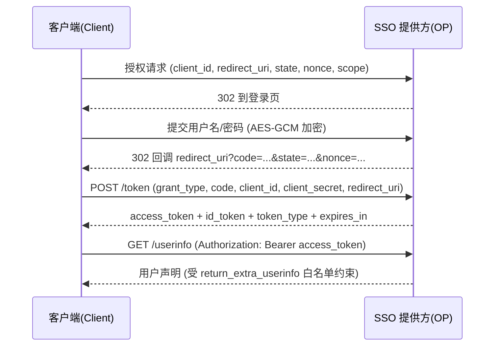

# zline SSO

为进才中学学生会网络服务开发的校园工作台账号OIDC映射器。

将 zline（进才校园工作台）账号认证桥接为标准OpenID Connect提供方，
供第三方应用完成单点登录。

## 目录

- [OIDC 端点](#oidc-端点)
- [配置说明](#配置说明)
- [OIDC 合规说明](#oidc-合规说明)
- [返回用户信息白名单](#返回用户信息白名单)
- [日志](#日志)
- [编译与运行](#编译与运行)
- [测试](#测试)

## OIDC 端点

| 端点 | 方法 | 说明 |
| --- | --- | --- |
| `/.well-known/openid-configuration` | GET | OIDC 发现文档（不随 `auth_path_prefix` 改变） |
| `{prefix}/` | GET | 登录页（`authorization_endpoint`） |
| `{prefix}/login` | POST | 提交登录（前端加密负载） |
| `{prefix}/continue` | GET | 已登录会话直接换取授权码 |
| `{prefix}/token` | POST | Token 端点（`authorization_code`） |
| `{prefix}/userinfo` | GET | UserInfo 端点（Bearer Token） |
| `{prefix}/jwks` | GET | JSON Web Key Set |
| `{prefix}/logout` | GET | 登出 |
| `{prefix}/profile/api` | GET | 个人中心 API |

> `prefix` 为配置中的 `auth_path_prefix`（示例为 `/sso`）。

## 配置说明

`config.toml` 关键字段：

| 字段 | 说明 |
| --- | --- |
| `issuer` | 发行方标识，用于 JWT `iss` 与发现文档 |
| `auth_path_prefix` | 业务路由前缀（`{prefix}` 与 `{prefix}/` 均可用） |
| `frontend_crypto.shared_key` | 前端登录负载 AES-256-GCM 共享密钥 |
| `account_lockout` | 登录失败锁定策略 |
| `cors_allowed_origins` | 允许跨域访问的来源列表（用于 CORS 响应头） |
| `clients[]` | 已注册 OIDC 客户端 |
| `clients[].redirect_uris` | 允许的回调地址列表，支持**字面量精确匹配**或**正则表达式** |
| `clients[].return_extra_userinfo` | **UserInfo 返回字段白名单**（见下） |

### `redirect_uris` 匹配规则

`redirect_uris` 中的每个条目既可写纯字面量（如 `"http://127.0.0.1:8080/callback"`，进行精确字符串匹配），
也可写正则表达式（条目包含 `* + ? ( ) [ ] { } ^ $ | \` 等元字符时按正则匹配，例如 `"^http://localhost:\\d+/callback$"`）。
登录、`/continue` 与 `/token` 三个端点均按该规则校验，`/token` 中的 `redirect_uri` 不再要求与授权请求逐字节一致。

## OIDC 合规说明

服务端实现遵循 OIDC Core 1.0 `authorization_code` 流程：

- **ID Token 与 Access Token 分离**：`/token` 返回两个独立 JWT，ID Token 包含标准声明
  `iss / sub / aud / exp / iat / auth_time / azp / nonce`。
- **nonce 绑定**：授权请求携带的 `nonce` 会原样写入 ID Token，客户端必须校验，防止重放/会话劫持。
- **Token 端点校验**：必须传 `grant_type=authorization_code`，并再次校验 `redirect_uri`。
- **签名**：所有令牌由服务端 RSA 私钥以 `RS256` 签发，公钥通过 `/jwks` 暴露。

### 授权码流程（Authorization Code Flow）



### 客户端应做的校验

1. 校验 ID Token 签名（通过 `/jwks` 获取公钥）与 `iss`、`aud`。
2. 校验 ID Token 中的 `nonce` 与授权请求时生成的一致。
3. 校验 `state` 参数防止 CSRF。

## 返回用户信息白名单

`clients[].return_extra_userinfo` 定义了该客户端在 `/userinfo` 中**允许返回**的字段白名单。

**未列入白名单的字段一律不会返回**，防止超出授权范围泄露信息。

当前支持的可选字段：

| 字段 | 说明 |
| --- | --- |
| `external_uid` | 外部唯一 UID |
| `full_name` | 姓名 |
| `student_id` | 学号 |
| `gender` | 性别 |
| `role` | 角色 |

基础声明 `sub` 与 `preferred_username`（由 `sub` 派生）始终返回，属于 OIDC 标准声明。

## 日志

使用 `tracing` 结构化日志：

- 启动时输出配置摘要与监听地址。
- `TraceLayer` 记录每个 HTTP 请求的 method、URI、状态码与耗时。
- 登录成功/失败、Token 签发、UserInfo 访问均有结构化日志。

日志级别通过环境变量 `RUST_LOG` 控制（默认 `info`）：

```powershell
$env:RUST_LOG = "debug"; cargo run     # Windows
RUST_LOG=debug cargo run               # Linux/macOS
```

## 编译与运行

```bash
# 1. 构建前端
cd ./frontend/
pnpm install
pnpm run build
cd ..

# 2. 编译
cargo build
# 生产（linux musl 静态链接）
cargo build --target x86_64-unknown-linux-musl --release

# 3. 运行
cargo run
```

运行后访问 `http://127.0.0.1:8097/sso/`。

## 测试

Python 样例客户端依赖：

```bash
pip install flask requests
```

以样例客户端联调：

```bash
python app.py     # 启动在 8080 端口，访问 http://127.0.0.1:8080/login
```

> `app.py` 演示了完整流程：生成并保存 `nonce` → 授权请求 → 换取 token →
> 校验 ID Token 的 `nonce` → 调用 UserInfo。
